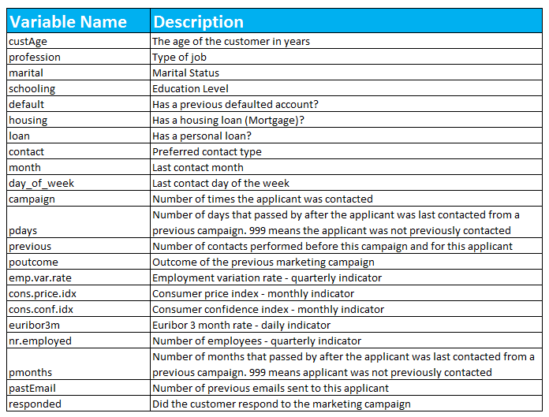

# Case B - Interview
Elevate - Data Science Team  
May 4, 2018  

  

  

# Introduction

Thank you for taking the time to complete the following case interview. The Elevate Data Science is excited to get a peak into your technical skills and problem solving expertise as you take on this small exercise. Please keep in mind that you are being evaluated not just on the performance of your model, but also how you set up your experiment and delivered the final presentation during your onsite interview. 

This case interview is meant to be fun, for you to be creative and test the limits of your ability. We love seeing new ways of thinking about our challenges so, we are looking forward to see what your analysis will bring. 

# The Case Interview 

Before your Onsite Interview: 

  - Download and consume the data located in this repository
  - Pre-process the data, handle missing, class imbalances, etc. 
  - Get creative with data engineering
  - Get creative with dimensionality reduction
  - Build a model: 
      - Apply appropiate sampling to split your population
      - Balance complexity and Performance (Variance / Bias)
      - Use sound cross validation techniques
      - Provide the performance measurements of the model
  - Create a Rmarkdown, Python Notebook or Powerpoint presentation walking us through what you did

During your Onsite Interview: 

  - You will be alloted 30 minutes to present your project
  - Hiring manager will hold 15 minutes for questions

## Do's and Don'ts 

This is a straight forward exercise that should be quite familiar even to recent graduates. Here are a few things to keep in mind while you work on this project: 

  - Create a draft of how you will tackle the exercise then Follow your instinct
  - At Elevate Data Science we are tool agnostic. Feel free to develop on R, Python or use any other ML Libraries as you see fit. 
  - Do not worry. There is no right AUC or set of predictors that guarantee your success. Be thoughtful but do not spend too much time on the minutae.   
  - Do not plagarize work, we do comprehensive searches of the web to compare code. 
  - Maintain reproducibility, set the appropiate seeds. 
  - Deep learning applications are not preferable given the size of data and project scope. 
  
    

## Exercise Context 
Your Hiring manger wants you to develop a tool to optimize their marketing efforts. The Marketing team has collected some data from previous marketing campaign. The data set includes customer information, described below, as a well as whether the customer responded to the marketing campaign or not. Here are the descriptions of each column in the data set:

## About Elevate

Elevate is reinventing the non-prime lending industry by giving consumers access to responsible and transparent credit options. Our core beliefs are reflected in everything we do.

  - We believe the highest cost of credit is no credit at all
  - We believe non-prime credit needs to be priced to risk with no hidden or punitive fees
  - We believe improvements in technology, analytics and scale should benefit our customers through lower prices
  - We believe in "Good Today, Better Tomorrow"
  - We believe the need for non-prime credit is here to stay
  
Visit us at [www.elevate.com](https://www.elevate.com/home.html)

View Open Careers [Here](https://recruiting.ultipro.com/ELE1006ELECS/JobBoard/ded7891f-5a68-425e-9106-6446596da16b/?q=&o=postedDateDesc)

